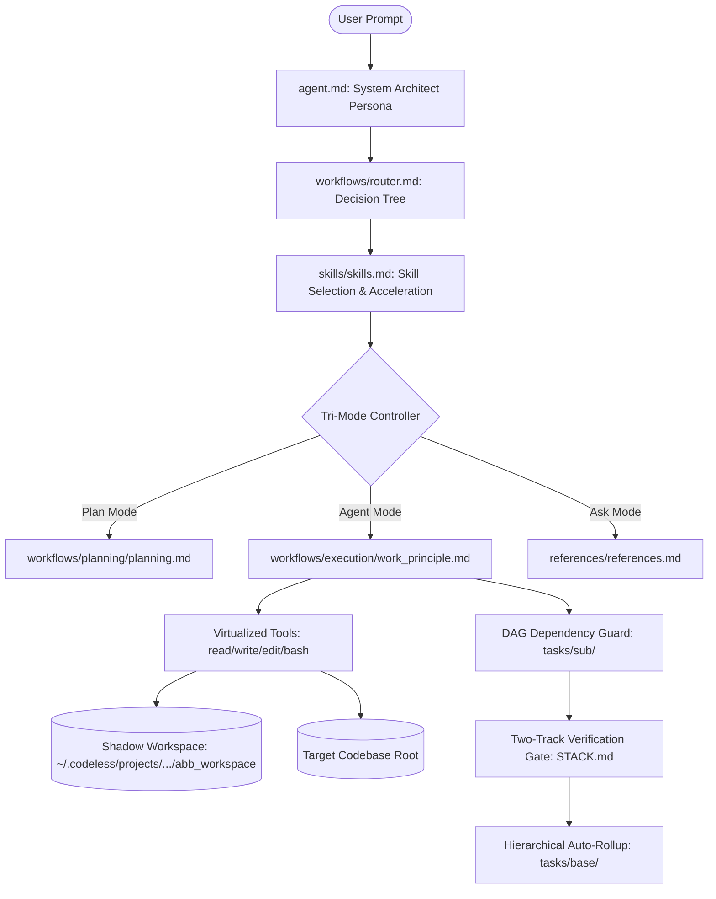

# ⚡ Codeless

> **"Code less: you steer the base, the harness builds."**

[](https://www.python.org/)
[](https://github.com/)
[-orange.svg)](https://github.com/)
[](https://github.com/HKUDS/OpenHarness)
[](LICENSE)

```
 ██████╗  ██████╗ ██████╗ ███████╗██╗     ███████╗███████╗███████╗
██╔════╝ ██╔═══██╗██╔══██╗██╔════╝██║     ██╔════╝██╔════╝██╔════╝
██║      ██║   ██║██║  ██║█████╗  ██║     █████╗  ███████╗███████╗
██║      ██║   ██║██║  ██║██╔══╝  ██║     ██╔══╝  ╚════██║╚════██║
╚██████╗ ╚██████╔╝██████╔╝███████╗███████╗███████╗███████║███████║
 ╚═════╝  ╚═════╝ ╚═════╝ ╚══════╝╚══════╝╚══════╝╚══════╝╚══════╝
```

**Codeless** is an autonomous agent execution harness engineered specifically to orchestrate, execute, and verify software projects governed by the **Agent Buildable Base (ABB)** paradigm.

It bridges declarative, modular repository governance with autonomous AI agent execution, deterministic DAG dependency guardrails, zero-pollution shadow workspaces, and multi-track automated verification.

---

## 🏛️ Upstream Heritage & Attribution

Codeless is built upon the foundation of [**HKUDS/OpenHarness**](https://github.com/HKUDS/OpenHarness) (licensed under Apache 2.0). 

We have hard-forked and heavily evolved OpenHarness into a specialized runtime for **Agent Buildable Base (ABB)** development. Key enhancements include:
- **Zero-Pollution Shadow Workspace Virtualization**: Isolates all agent governance files and logs to user AppData storage.
- **Topological DAG Task Gating & Auto-Rollup**: Hierarchical task decomposition (`goal` → `base` → `sub`) with strict dependency enforcement.
- **Two-Track Manifest-Driven Verification**: `STACK.md` test execution gates preventing subtask completion on test regressions.
- **Tri-Mode Permission System**: Dynamic runtime filtering of LLM tool schemas across `PLAN`, `AGENT`, and `ASK` modes.
- **React/Ink TUI ABB Panels**: Live 3-State badge, active workflow routing banners, and interactive DAG tree visualizers.

---

## 🧠 The Agent Buildable Base (ABB) Paradigm

Traditional AI coding assistants struggle with hallucination, scope creep, and context degradation on large codebases. The **Agent Buildable Base (ABB)** paradigm solves this by structuring projects into declarative, machine-readable governance contracts.



### 1. 🛡️ Zero-Pollution Shadow Workspaces
When you run Codeless on **any project directory**, Codeless computes a deterministic SHA-256 hash of the project path and automatically provisions an isolated ABB shadow workspace at:
```
~/.codeless/projects/<project_hash>/abb_workspace/
```
Your target repository remains **100% pristine** — zero governance markdown files or temporary session states pollute your git commits. *(For template authors and framework developers, an in-repo dev override at `.codeless/abb_workspace/` is also supported).*

### 2. 🧭 Router & Persona Workflows (`agent.md` & `router.md`)
- [`agent.md`](file:///c:/Akshat/codeless/.codeless/abb_workspace/agent.md): Injects the foundational System Architect persona and establishes the core governance framework on every turn.
- [`router.md`](file:///c:/Akshat/codeless/.codeless/abb_workspace/workflows/router.md): The universal routing engine. Classifies incoming user prompts and dynamically routes execution into specialized workflows (`planning`, `init_project`, `execution`, `bugfix`, `refactor`, `verification`).
- **Skill Discovery**: Before executing, the model checks [`skills/skills.md`](file:///c:/Akshat/codeless/.codeless/abb_workspace/skills/skills.md) to inspect and adopt matching domain skills (e.g. `practice/tdd`, `practice/verification_before_completion`, `ui/frontend_design`).
- **Linked Governance System**:
  - `USER_PREFERENCES.md` (User preferences and conventions)
  - `STACK.md` (Tech stack, tooling, and Two-Track test verification manifest)
  - `CODING_PHILOSOPHY.md` (TDD, simplicity, modularity)
  - `CONVENTIONS.md` (Naming, code style, git commit standards)
  - `CHANGELOG.md` (Release milestones and revision history)
  - `tasks/` (Topological DAG task tracking)
  - `design/` & `features/` (Architecture and feature blueprints)
  - `references/` (Contextual domain memory bank)

### 3. 🔒 Tri-Mode Permissions & Tool Filtering
Codeless provides 3 operational modes with runtime tool schema filtering:

| Mode | Visual Badge | Allowed Tool Schemas | Write Permissions |
| :--- | :--- | :--- | :--- |
| **`PLAN`** | `[📐 PLAN]` | `read_file`, `glob`, `grep`, `lsp`, `view_file`, `write_file`*, `edit_file`* | **Governance only** (`tasks/`, `design/`, `features/`, `STACK.md`). Code modifications and shell commands (`bash`) are omitted. |
| **`AGENT`** | `[⚡ AGENT]` | **All 43 tools** (`bash`, `read_file`, `write_file`, `edit_file`, `lsp`, etc.) | **Full access** across codebase and workspace. |
| **`ASK`** | `[💬 ASK]` | `read_file`, `glob`, `grep`, `lsp`, `view_file`, `ask_user_question` | **Read-only**. All write and mutating tools omitted. |

### 4. 🌲 Topological Task DAGs & Auto-Rollup
Tasks are decomposed hierarchically with deterministic YAML frontmatter:
- **`tasks/goal/`**: Master project vision and success criteria.
- **`tasks/base/`**: Major milestones and architecture deliverables.
- **`tasks/sub/`**: Atomic, testable units of work with explicit `depends_on` lists.

The **DAG Gate Hook** strictly prevents subtasks from moving to `in_progress` until all dependency tasks are `status: done`. When all child subtasks complete, the parent base task automatically rolls up to `status: done`.

### 5. 🧪 Two-Track Verification Gates (`STACK.md`)
Every project defines a verification manifest in its `STACK.md`:
```yaml
---
verification:
  track_1:
    - pytest tests/unit/
  track_2:
    - pytest tests/e2e/
    - npx tsc --noEmit
---
```
A subtask **cannot** transition to `status: done` unless both Track 1 (Fast Unit Tests) and Track 2 (Integration/E2E) suites execute and return exit code `0`.

---

## 💻 Installation & Setup

### Prerequisites
- Python `3.11+`
- Node.js `18+` (for React/Ink TUI terminal bundle)
- [`uv`](https://github.com/astral-sh/uv) (recommended) or `pip`

### Global CLI Installation

From your local clone of Codeless:
```bash
# Recommended: Isolated editable tool environment via uv
uv tool install --editable .

# Or via standard pip:
pip install -e .
```

This registers two global executables in your PATH:
- **`codeless`** (Primary CLI)
- **`clh`** (Fast alias)

---

## 🔑 Setting Up API Keys & Providers

Codeless features a universal provider gateway supporting OpenAI, Anthropic, DeepInfra, OpenRouter, and local OpenAI-compatible endpoints (Ollama, vLLM, LM Studio).

### Option 1: Saved Provider Profiles (Recommended)

Save your provider profile once in `~/.codeless/settings.json` and credentials in `~/.codeless/credentials.json`:

#### DeepInfra Example
```powershell
codeless provider add deepinfra `
  --label "DeepInfra" `
  --provider openai-compatible `
  --api-format openai `
  --auth-source api_key `
  --base-url "https://api.deepinfra.com/v1/openai" `
  --model "deepseek-ai/DeepSeek-V4-Flash-0731" `
  --allowed-model "deepseek-ai/DeepSeek-V4-Flash-0731" `
  --allowed-model "deepseek-ai/DeepSeek-V4-Pro" `
  --allowed-model "Qwen/Qwen3.8-2.4T-A95B" `
  --context-window-tokens 1048576 `
  --api-key "YOUR_DEEPINFRA_API_KEY"

# Activate deepinfra
codeless provider use deepinfra
```

#### Official Anthropic (Claude) Example
```powershell
codeless provider add anthropic `
  --label "Anthropic Claude" `
  --provider anthropic `
  --api-format anthropic `
  --auth-source anthropic_api_key `
  --model "claude-3-7-sonnet-20250219" `
  --api-key "YOUR_ANTHROPIC_API_KEY"

codeless provider use anthropic
```

#### Local LLM (Ollama / vLLM) Example
```powershell
codeless provider add local `
  --label "Local Ollama" `
  --provider openai-compatible `
  --api-format openai `
  --auth-source api_key `
  --base-url "http://localhost:11434/v1" `
  --model "qwen2.5-coder:32b" `
  --api-key "none"

codeless provider use local
```

### Option 2: Environment Variables (Current Terminal)
```powershell
# PowerShell:
$env:OPENAI_API_KEY = "your-api-key"
$env:OPENAI_BASE_URL = "https://api.deepinfra.com/v1/openai"
```
```bash
# Bash / Linux / macOS:
export OPENAI_API_KEY="your-api-key"
export OPENAI_BASE_URL="https://api.deepinfra.com/v1/openai"
```

### Option 3: Inline Flags
```bash
codeless --api-key "your-key" --base-url "https://api.deepinfra.com/v1/openai" --model "deepseek-ai/DeepSeek-V4-Pro"
```

---

## 🚀 Usage Guide

### 1. Pre-Flight Dry-Run Audit
Run a non-destructive audit of project readiness, shadow workspace integrity, and STACK manifests:
```bash
codeless --dry-run
```

### 2. Launching the Interactive Session
Navigate to **any directory** and launch Codeless:
```bash
cd C:\path\to\your\project
codeless
```

### 3. Keyboard Shortcuts in Interactive TUI
- **`Tab`**: Quickly cycle between **`[PLAN]`**, **`[AGENT]`**, and **`[ASK]`** modes.
- **`/`**: Open the interactive slash command autocomplete menu.
- **`Ctrl+C`**: Interrupt active generation or exit.
- **`↑ / ↓`**: Navigate input history.
- **`Shift + Enter`**: Multi-line prompt input.

---

## ⚡ ABB Slash Commands Reference

| Slash Command | Description |
| :--- | :--- |
| **`/mode <plan\|agent\|ask>`** | Switch operational permission mode and toggle tool availability. |
| **`/task [task_id]`** | Display the live topological DAG hierarchy and subtask progress. |
| **`/plan <goal>`** | Run the architectural planner to decompose a feature into tasks. |
| **`/verify`** | Run the Two-Track verification test runner against `STACK.md`. |
| **`/route <prompt>`** | Manually classify and inspect the ABB workflow decision path for a prompt. |
| **`/init`** | Initialize ABB governance structure, `STACK.md`, and project memory. |
| **`/goal`** | Inspect current high-level goal and milestone progress. |
| **`/feature`** | View feature specifications registered in `features/`. |
| **`/model`** | Interactive menu to switch between allowed LLM models. |
| **`/compact`** | Trigger an intelligent context-window compaction turn. |
| **`/cost`** / **`/usage`** | Display token consumption and session cost metrics. |
| **`/help`** | List all available interactive slash commands. |

---

## 🧰 Tools & Path Virtualization

Codeless adheres to strict design discipline: **No custom tool bloat.** 

Rather than introducing hundreds of brittle, single-purpose tools, Codeless provides a robust standard toolset with **Shadow Path Virtualization**:

- **File Operations (`read_file`, `write_file`, `edit_file`)**: Automatically resolve virtual ABB paths (`agent.md`, `tasks/*`, `workflows/*`, `design/*`, `references/*`, `STACK.md`) to the AppData shadow workspace, while resolving source code directly to your project root.
- **Search Operations (`glob`, `grep`)**: Seamlessly search both the project repository and the active shadow workspace concurrently.
- **Execution (`bash`)**: Runs commands in the project root with real-time streaming and cancellation support.
- **Code Intelligence (`lsp`)**: Diagnostics, definitions, references, and symbol search.

---

## 🧪 Verification & Development

To run the complete Codeless test suite:

```powershell
# Run full ABB, UI, and Command test suites
uv run pytest tests/abb/ tests/test_commands/ tests/test_ui/ -v

# Typecheck Frontend TypeScript
cd frontend/terminal
npx tsc --noEmit
```

---

## 📄 License

Codeless is open-source software licensed under the [Apache License 2.0](LICENSE).  
Portions derived from [HKUDS/OpenHarness](https://github.com/HKUDS/OpenHarness) under Apache-2.0.
