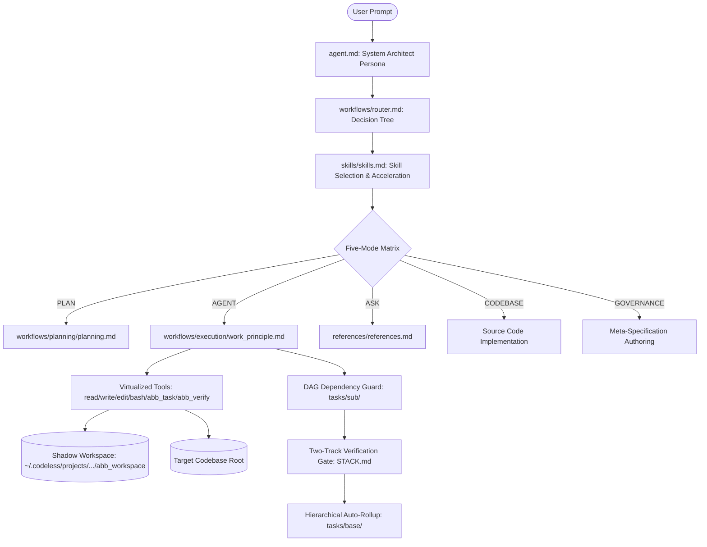
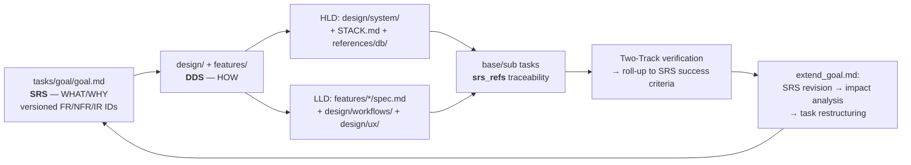

# ⚡ Codeless

> **"Code less: you steer the base, the harness builds."**

[](https://www.python.org/)
[](https://github.com/)
[-orange.svg)](https://github.com/)
[](https://github.com/HKUDS/OpenHarness)
[](LICENSE)

```
 ██████╗  ██████╗ ██████╗ ███████╗██╗     ███████╗███████╗███████╗
██╔════╝ ██╔═══██╗██╔══██╗██╔════╝██║     ██╔════╝██╔════╝██╔════╝
██║      ██║   ██║██║  ██║█████╗  ██║     █████╗  ███████╗███████╗
██║      ██║   ██║██║  ██║██╔══╝  ██║     ██╔══╝  ╚════██║╚════██║
╚██████╗ ╚██████╔╝██████╔╝███████╗███████╗███████╗███████║███████║
 ╚═════╝  ╚═════╝ ╚═════╝ ╚══════╝╚══════╝╚══════╝╚══════╝╚══════╝
```

**Codeless** is an autonomous agent execution harness engineered specifically to orchestrate, execute, and verify software projects governed by the **Agent Buildable Base (ABB)** paradigm.

It bridges declarative, modular repository governance with autonomous AI agent execution, deterministic DAG dependency guardrails, zero-pollution shadow workspaces, unified prompt composition, and multi-track automated verification.

---

## 🏛️ Upstream Heritage & Evolution

Codeless is built upon the foundation of [**HKUDS/OpenHarness**](https://github.com/HKUDS/OpenHarness) (licensed under Apache 2.0).

We hard-forked and evolved OpenHarness into a specialized, bloat-free runtime for **Agent Buildable Base (ABB)** development:
- **Zero-Pollution Shadow Workspace Virtualization**: Isolates all agent governance files, logs, and sessions to user AppData storage.
- **Unified Prompt Composer**: Single prompt composition authority fusing harness mechanics and ABB persona (`agent.md` + router) with zero redundant guidance.
- **Five-Mode Operational Matrix**: Atomic mode authority (`AGENT`, `PLAN`, `ASK`, `CODEBASE`, `GOVERNANCE`) enforcing tool provisioning and strict domain write boundaries.
- **Static Bash Mode Guard**: Pre-tool static syntax and command analysis intercepting unauthorized mutations before shell execution.
- **Topological DAG Task Gating & Auto-Rollup**: Hierarchical task decomposition (`goal` → `base` → `sub`) with strict dependency enforcement.
- **Two-Track Manifest-Driven Verification**: `STACK.md` test execution gates preventing subtask completion on test regressions.
- **Read-Only ABB Native Tools**: In-session DAG querying (`abb_task`) and manifest test runner (`abb_verify`).
- **ABB Native Agents**: Special-purpose `task-planner` and `abb-governance` agents with mode-aware spawning filters.
- **Docker & Sandbox Coherence**: Read-write shadow ABB workspace mounts into Docker and `srt` sandboxes with `CODELESS_ABB_ROOT` environment coherence.
- **React/Ink TUI Live Status**: Uppercase badges (`⚡ AGENT`, `📐 PLAN`, `💬 ASK`, `🔍 CODEBASE`, `🏛️ GOVERNANCE`), interactive `/mode` select modal, and live DAG visualizers.

---

## 🧠 The Agent Buildable Base (ABB) Paradigm

Traditional AI coding assistants struggle with hallucination, scope creep, and context degradation on large codebases. The **Agent Buildable Base (ABB)** paradigm solves this by structuring projects into declarative, machine-readable governance contracts.



### The Governance Loop: SRS → DDS → Tasks → Verify → Revise

Codeless runs a closed, non-duplicating loop across the ABB governance layers. Each layer links to the next; nothing is copied between them.



- **SRS** (`tasks/goal/goal.md`): the Goal file is a versioned **Software Requirements Specification** — purpose, scope, constraints, and stable requirement IDs (`FR-###`, `NFR-###`, `IR-###`) that are never reused.
- **DDS** (`design/design.md`): the **Design Document Specification** umbrella, split into **HLD** (architecture, stack, DB, major modules) and **LLD** (component logic, APIs, data structures, workflows).
- **Tasks** (`tasks/base/`, `tasks/sub/`): execution units, each carrying `srs_refs` back to the requirements they satisfy.
- **Revise** (`workflows/planning/extend_goal.md`): when a requirement changes, the SRS is version-bumped, an impact analysis finds every affected task via `srs_refs`, and the tree is restructured (add / improve / supersede / renumber).

---

## 🔒 Five-Mode Operational Matrix

Codeless provides 5 distinct operational modes. The active mode is the single authority for persona prompt composition, tool allow-lists, and domain write boundaries:

| Mode | Visual Badge | Allowed Tool Schemas | Domain Write Boundary |
| :--- | :--- | :--- | :--- |
| **`AGENT`** | `[⚡ AGENT]` | **All 41 tools** (`bash`, `read_file`, `write_file`, `edit_file`, `abb_task`, `abb_verify`, `lsp`, etc.) | **Unrestricted implementation & verification** across codebase and workspace (Two-Track verification gate active). |
| **`PLAN`** | `[📐 PLAN]` | `read_file`, `glob`, `grep`, `lsp`, `view_file`, `write_file`*, `edit_file`*, `abb_task`, `abb_verify` | **Planning only** (`tasks/` and `design/`). Production code mutations and mutating shell commands (`bash`) are blocked. |
| **`ASK`** | `[💬 ASK]` | `read_file`, `glob`, `grep`, `lsp`, `view_file`, `abb_task`, `ask_user_question` | **Read-only inquiry**. All file mutations and shell executions are blocked. |
| **`CODEBASE`** | `[🔍 CODEBASE]` | `read_file`, `glob`, `grep`, `lsp`, `view_file`, `abb_task`, `ask_user_question` | **Codebase exploration & memory queries**. Strictly read-only repository-wide. |
| **`GOVERNANCE`** | `[🏛️ GOVERNANCE]` | `read_file`, `glob`, `grep`, `lsp`, `view_file`, `write_file`*, `edit_file`*, `abb_task`, `abb_verify` | **Meta-spec maintenance** (`STACK.md`, `agent.md`, `features/`, `references/`, `workflows/`, `skills/`). Production code files are protected. |

---

## 🛡️ Core System Features

### 1. 🛡️ Zero-Pollution Shadow Workspaces
When you run Codeless on **any project directory**, Codeless computes a deterministic SHA-256 hash of the project path and automatically provisions an isolated ABB shadow workspace at:
```
~/.codeless/projects/<project_hash>/abb_workspace/
```
Your target repository remains **100% pristine** — zero governance markdown files or temporary session states pollute your git commits. *(For template authors and framework developers, an in-repo dev override at `.codeless/abb_workspace/` is also supported).*

### 2. 🛡️ Static Bash Mode Guard
When operating in restricted modes (`PLAN`, `ASK`, `CODEBASE`, `GOVERNANCE`), the pre-tool lifecycle hook performs static syntax and argument analysis on all shell commands:
- Intercepts redirection file writes (`>`, `>>`)
- Intercepts file mutation commands (`rm`, `mv`, `cp`, `mkdir`, `touch`, `tee`, etc.)
- Intercepts package and repository mutations (`git commit`, `git push`, `npm install`, `pip install`, etc.)
Unauthorized commands are rejected with a clear domain violation message before any process is spawned.

### 3. 🌲 Topological Task DAGs & Auto-Rollup
Tasks are decomposed hierarchically with deterministic YAML frontmatter:
- **`tasks/goal/`**: the **SRS** — master project vision, versioned requirements (`FR-###` / `NFR-###` / `IR-###`), and success criteria.
- **`tasks/base/`**: major milestones and architecture deliverables, each carrying `srs_refs` to the requirements it satisfies.
- **`tasks/sub/`**: atomic, testable units of work with explicit `depends_on` lists and optional `srs_refs`.

The **DAG Gate Hook** strictly prevents subtasks from moving to `in_progress` until all dependency tasks are `status: done`. When all child subtasks complete, the parent base task automatically rolls up to `status: done`.

### 4. 🧪 Two-Track Verification Gates (`STACK.md`)
Every project defines a verification manifest in its `STACK.md`:
```yaml
---
verification:
  track_1:
    - pytest tests/unit/
  track_2:
    - pytest tests/e2e/
    - npx tsc --noEmit
---
```
A subtask **cannot** transition to `status: done` unless both Track 1 (Fast Unit Tests) and Track 2 (Integration/E2E) suites execute and return exit code `0`.

### 5. 🧰 Native Read-Only ABB Tools
- **`abb_task`**: Inspect task DAG status inside the session (`list`, `show <task_id>`, `ready`, `blocked-by <task_id>`).
- **`abb_verify`**: Execute Track 1 / Track 2 verification manifests in live or dry-run mode directly from agent workflows.

---

## 💻 Installation & Setup

### Prerequisites
- Python `3.11+`
- Node.js `18+` (for React/Ink TUI terminal bundle)
- [`uv`](https://github.com/astral-sh/uv) (recommended) or `pip`

### Global CLI Installation

From your local clone of Codeless:
```bash
# Recommended: Isolated editable tool environment via uv
uv tool install --editable .

# Or via standard pip:
pip install -e .
```

This registers two global executables in your PATH:
- **`codeless`** (Primary CLI)
- **`clh`** (Fast alias)

---

## 🔑 Setting Up API Keys & Providers

Codeless features a universal provider gateway supporting OpenAI, Anthropic, DeepInfra, OpenRouter, and local OpenAI-compatible endpoints (Ollama, vLLM, LM Studio).

### Option 1: Saved Provider Profiles (Recommended)

Save your provider profile once in `~/.codeless/settings.json` and credentials in `~/.codeless/credentials.json`:

#### DeepInfra Example
```powershell
codeless provider add deepinfra `
  --label "DeepInfra" `
  --provider openai-compatible `
  --api-format openai `
  --auth-source api_key `
  --base-url "https://api.deepinfra.com/v1/openai" `
  --model "deepseek-ai/DeepSeek-V4-Flash-0731" `
  --allowed-model "deepseek-ai/DeepSeek-V4-Flash-0731" `
  --allowed-model "deepseek-ai/DeepSeek-V4-Pro" `
  --allowed-model "Qwen/Qwen3.8-2.4T-A95B" `
  --context-window-tokens 1048576 `
  --api-key "YOUR_DEEPINFRA_API_KEY"

# Activate deepinfra
codeless provider use deepinfra
```

#### Official Anthropic (Claude) Example
```powershell
codeless provider add anthropic `
  --label "Anthropic Claude" `
  --provider anthropic `
  --api-format anthropic `
  --auth-source anthropic_api_key `
  --model "claude-3-7-sonnet-20250219" `
  --api-key "YOUR_ANTHROPIC_API_KEY"

codeless provider use anthropic
```

#### Local LLM (Ollama / vLLM) Example
```powershell
codeless provider add local `
  --label "Local Ollama" `
  --provider openai-compatible `
  --api-format openai `
  --auth-source api_key `
  --base-url "http://localhost:11434/v1" `
  --model "qwen2.5-coder:32b" `
  --api-key "none"

codeless provider use local
```

### Option 2: Environment Variables (Current Terminal)
```powershell
# PowerShell:
$env:OPENAI_API_KEY = "your-api-key"
$env:OPENAI_BASE_URL = "https://api.deepinfra.com/v1/openai"
```
```bash
# Bash / Linux / macOS:
export OPENAI_API_KEY="your-api-key"
export OPENAI_BASE_URL="https://api.deepinfra.com/v1/openai"
```

---

## 🚀 Usage Guide

### 1. Launching the Interactive Session
Navigate to **any directory** and launch Codeless:
```bash
cd C:\path\to\your\project
codeless
```

### 2. Keyboard Shortcuts in Interactive TUI
- **`Tab`** (on empty prompt): Open the interactive **Operational Mode** selector modal (`AGENT`, `PLAN`, `ASK`, `CODEBASE`, `GOVERNANCE`).
- **`/`**: Open the interactive slash command autocomplete menu.
- **`Ctrl+C`**: Interrupt active generation or exit.
- **`↑ / ↓`**: Navigate input history or modal selections.
- **`Shift + Enter`**: Multi-line prompt input.

---

## ⚡ Slash Commands Reference

| Slash Command | Description |
| :--- | :--- |
| **`/mode [mode]`** | Open operational mode selector or switch directly (`agent`, `plan`, `ask`, `codebase`, `governance`). |
| **`/plan <goal>`** | Run the architectural planner to decompose a feature into tasks. |
| **`/task [task_id]`** | Display live topological DAG hierarchy and subtask status. |
| **`/verify`** | Run Two-Track test verification against `STACK.md`. |
| **`/route <prompt>`** | Manually classify and inspect the ABB workflow decision path for a prompt. |
| **`/init`** | Initialize ABB governance structure, `STACK.md`, and project memory. |
| **`/goal`** | Inspect current SRS (goal) and milestone progress. |
| **`/feature`** | View feature specifications registered in `features/`. |
| **`/skills`** | Inspect active skills in `skills/`. |
| **`/drift`** | Run schema and file drift audit between code and meta-specs. |
| **`/checkpoint`** | Create a safety git snapshot of current workspace state. |
| **`/stack`** | View `STACK.md` technology stack and verification configuration. |
| **`/prefs`** | View or update `USER_PREFERENCES.md`. |
| **`/provider`** | Open interactive provider profile selector. |
| **`/model`** | Open interactive model selector. |
| **`/compact`** | Trigger an intelligent context-window compaction turn. |
| **`/cost`** / **`/usage`** | Display token consumption and session cost metrics. |
| **`/help`** | List all available interactive slash commands. |

---

## 🧪 Verification & Development

To run the complete Codeless test suite:

```powershell
# Run full test suite (1,106+ unit, ABB, UI, and integration tests)
uv run pytest -q

# Run ABB and E2E suites specifically
uv run pytest tests/abb/ -v
```

---

## 📄 License

Codeless is open-source software licensed under the [Apache License 2.0](LICENSE).  
Portions derived from [HKUDS/OpenHarness](https://github.com/HKUDS/OpenHarness) under Apache-2.0.

