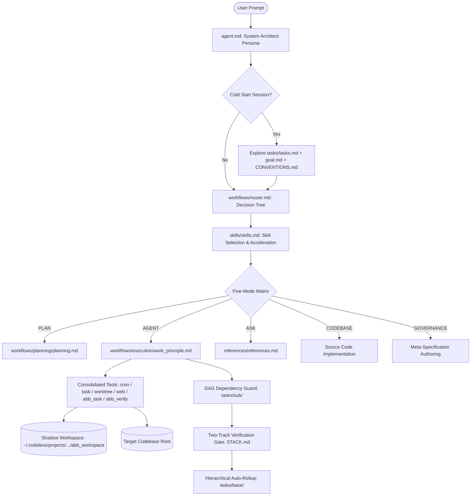
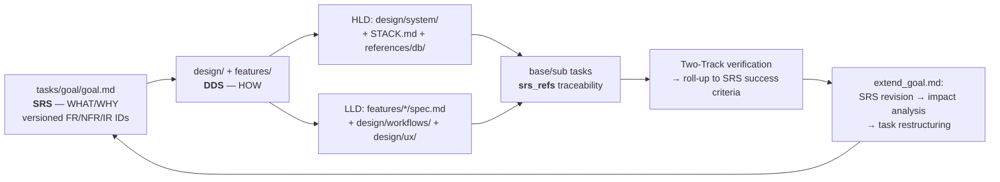

# ⚡ Codeless

> **"Code less: you steer the base, the harness builds."**

[](https://www.python.org/)
[](https://github.com/)
[-orange.svg)](https://github.com/)
[](https://github.com/astral-sh/ruff)
[](https://github.com/HKUDS/OpenHarness)
[](LICENSE)

```
 ██████╗  ██████╗ ██████╗ ███████╗██╗     ███████╗███████╗███████╗
██╔════╝ ██╔═══██╗██╔══██╗██╔════╝██║     ██╔════╝██╔════╝██╔════╝
██║      ██║   ██║██║  ██║█████╗  ██║     █████╗  ███████╗███████╗
██║      ██║   ██║██║  ██║██╔══╝  ██║     ██╔══╝  ╚════██║╚════██║
╚██████╗ ╚██████╔╝██████╔╝███████╗███████╗███████╗███████║███████║
 ╚═════╝  ╚═════╝ ╚═════╝ ╚══════╝╚══════╝╚══════╝╚══════╝╚══════╝
```

**Codeless** is an autonomous agent execution harness engineered specifically to orchestrate, execute, and verify software projects governed by the **Agent Buildable Base (ABB)** paradigm.

It bridges declarative, modular repository governance with autonomous AI agent execution, deterministic DAG dependency guardrails, zero-pollution shadow workspaces, unified prompt composition, consolidated high-leverage tooling, and multi-track automated verification.

---

## 📖 Why i made this

> *"I use agents and lots of harnesses like Claude Code, Antigravity, and Copilot. But all of them share a fundamental flaw: they dump unstructured `.md` files in repositories and have no well-defined mechanism for when and how to reference them across old and new sessions. That project context is vital, but without structure, the model simply loses track."*
>
> *"To solve this, I designed **Agent Buildable Base (ABB)** — a project-specific memory and lifecycle tracking system that organizes requirements, system designs, component specs, and topological tasks into a living, verifiable contract. I iterate on ABB continuously as I discover real-world agent bottlenecks."*
>
> *"Then I built **Codeless** — a fast, dedicated CLI harness to operationalize ABB effortlessly. Along the way, it solved another major challenge: making other AI harnesses also benefit from ABB simply by feeding them ABB's root `agent.md` governance prompt as a clean workaround."*
>
> *"I also hated the tool bloat common in existing harnesses, where dozens of fine-grained CRUD tools consume precious LLM context tokens. In Codeless, we consolidate tools into multi-action powerhouses (`cron`, `task`, `worktree`, `mcp_resource`, `web`) with dynamic action-level permission evaluation. Most importantly, Codeless manages code and feature changes through the entire Software Development Lifecycle (SDLC) — making it unmistakably clear **what** is being built, **why** it is being built, and **how** it is verified."*

---

## 🏛️ Key Capabilities & Innovations

- **Zero-Pollution Shadow Workspace Virtualization**: Isolates all agent governance files, task DAGs, logs, and sessions in user AppData storage (`~/.codeless/projects/<project_hash>/abb_workspace/`), keeping target repositories 100% pristine.
- **Unified Prompt Composer**: Single prompt composition authority fusing harness mechanics and ABB persona (`agent.md` + router) with zero redundant guidance.
- **Five-Mode Operational Matrix**: Atomic mode authority (`AGENT`, `PLAN`, `ASK`, `CODEBASE`, `GOVERNANCE`) enforcing tool provisioning and strict domain write boundaries.
- **Tool Consolidation & Action Permissions**: Consolidated multi-action tools (`cron`, `task`, `worktree`, `mcp_resource`, `web`) reducing token overhead by ~60% with dynamic action-level `is_read_only` permission evaluation.
- **Unified Web Crawl Engine**: Structured Crawl4AI-inspired crawling, Markdown extraction, readability distillation, and CSS selector scoping.
- **Cold-Start Exploration & Template Choice**: Autonomous project context exploration on empty-history sessions and open-source template strategy ingestion.
- **Static Bash Mode Guard**: Pre-tool static syntax and command analysis intercepting unauthorized mutations before shell execution.
- **Topological DAG Task Gating & Auto-Rollup**: Hierarchical task decomposition (`goal` → `base` → `sub`) with strict dependency enforcement.
- **Two-Track Manifest-Driven Verification**: `STACK.md` test execution gates preventing subtask completion on test regressions.
- **Multi-Harness Interoperability**: Export and feed `agent.md` to Claude Code, Copilot, or Antigravity to bring ABB governance into any agent environment.

---

## 🧠 The Agent Buildable Base (ABB) Paradigm

Traditional AI coding assistants struggle with hallucination, scope creep, and context degradation on large codebases. The **Agent Buildable Base (ABB)** paradigm solves this by structuring projects into declarative, machine-readable governance contracts.



### The Governance Loop: SRS → DDS → Tasks → Verify → Revise

Codeless runs a closed, non-duplicating loop across the ABB governance layers:



- **SRS** (`tasks/goal/goal.md`): the Goal file is a versioned **Software Requirements Specification** — purpose, scope, constraints, and stable requirement IDs (`FR-###`, `NFR-###`, `IR-###`) that are never reused.
- **DDS** (`design/design.md`): the **Design Document Specification** umbrella, split into **HLD** (architecture, stack, DB, major modules) and **LLD** (component logic, APIs, data structures, workflows).
- **Tasks** (`tasks/base/`, `tasks/sub/`): execution units, each carrying `srs_refs` back to the requirements they satisfy.
- **Revise** (`workflows/planning/extend_goal.md`): when a requirement changes, the SRS is version-bumped, an impact analysis finds every affected task via `srs_refs`, and the tree is restructured.

---

## 🔒 Five-Mode Operational Matrix

Codeless provides 5 distinct operational modes. **Codeless sessions start in `[📐 PLAN]` mode by default** to review architecture, specs, and plans safely before code execution. The active mode is the single authority for persona prompt composition, tool allow-lists, and domain write boundaries:

| Mode | Visual Badge | Allowed Tool Schemas | Domain Write Boundary |
| :--- | :--- | :--- | :--- |
| **`PLAN` (Default)** | `[📐 PLAN]` | `read_file`, `glob`, `grep`, `lsp`, `view_file`, `write_file`*, `edit_file`*, `cron` (read), `task` (read), `worktree` (read), `web`, `abb_task`, `abb_verify` | **Planning only** (`tasks/` and `design/`). Production code mutations and mutating shell commands (`bash`) are blocked. |
| **`AGENT`** | `[⚡ AGENT]` | **All tools** (`bash`, `read_file`, `write_file`, `edit_file`, `cron`, `task`, `worktree`, `web`, `abb_task`, `abb_verify`, etc.) | **Unrestricted implementation & verification** across codebase and workspace (Two-Track verification gate active). |
| **`ASK`** | `[💬 ASK]` | `read_file`, `glob`, `grep`, `lsp`, `view_file`, `cron` (read), `task` (read), `worktree` (read), `web`, `abb_task`, `ask_user_question` | **Read-only inquiry**. All file mutations and shell executions are blocked. |
| **`CODEBASE`** | `[🔍 CODEBASE]` | `read_file`, `glob`, `grep`, `lsp`, `view_file`, `cron` (read), `task` (read), `worktree` (read), `web`, `abb_task`, `ask_user_question` | **Codebase exploration & memory queries**. Strictly read-only repository-wide. |
| **`GOVERNANCE`** | `[🏛️ GOVERNANCE]` | `read_file`, `glob`, `grep`, `lsp`, `view_file`, `write_file`*, `edit_file`*, `cron` (read), `task` (read), `worktree` (read), `web`, `abb_task`, `abb_verify` | **Meta-spec maintenance** (`STACK.md`, `agent.md`, `features/`, `references/`, `workflows/`, `skills/`). Production code files are protected. |

---

## 🧰 Consolidated Multi-Action Tools

Instead of polluting LLM context with dozens of granular tools, Codeless consolidates operations into intuitive multi-action schemas:

```
Consolidated Tool   Actions                           Dynamic is_read_only Evaluation
-----------------   --------------------------------  ---------------------------------------------------------
cron                create, list, delete, toggle      True if action == "list", else False
task                create, get, list, stop, output   True if action in {"get", "list", "output"}, else False
worktree            enter, exit, list                 True if action == "list", else False
mcp_resource        list, read                        True (all queries are read-only)
web                 crawl, search, fetch              True (all queries are read-only)
```

---

## 💻 Installation & Quickstart

### Prerequisites
- Python `3.11+`
- Node.js `18+` (for React/Ink TUI terminal bundle)
- [`uv`](https://github.com/astral-sh/uv) (recommended) or `pip`

### Global CLI Installation

```bash
# Recommended: Isolated editable tool environment via uv
uv tool install --force --editable .

# Sync local workspace & dev dependencies:
uv sync --extra dev

# Ensure frontend React terminal dependencies are installed:
cd frontend/terminal && npm install && cd ../..

# Or via standard pip:
pip install -e .
```

This registers two global executables in your PATH:
- **`codeless`** (Primary CLI)
- **`clh`** (Fast alias)

### Web Crawling & Scraping Engine
Codeless includes Crawl4AI and a fast structured HTML-to-Markdown parser out-of-the-box. The `web` tool automatically uses Crawl4AI's `AsyncWebCrawler` for JavaScript-rendered SPAs, selector extraction, and deep crawls with automated fallback to the lightweight engine.

### Launching on Any Project
```bash
cd /path/to/any/project
codeless
```

---

## 📚 Documentation & Guides

Explore detailed documentation for each capability in the [`docs/`](docs/index.md) directory:

- [**Documentation Portal & Sitemap**](docs/index.md)
- [**CLI Reference & Options**](docs/cli_reference.md)
- [**ABB Workspaces & Dual-Location Engine**](docs/abb_agent_buildable_base.md)
- [**Operational Modes & Domain Write Boundaries**](docs/modes_and_permissions.md)
- [**Subagent Workers & Concurrency Coordinator**](docs/subagent_workers.md)
- [**Skills System & Pull-Adapt-Delete Lifecycle**](docs/skills_and_staging.md)
- [**Git Checkpoints & Rollback Engine**](docs/checkpoints_and_rollback.md)
- [**Codebase Drift Auditor & Feedback Loop**](docs/drift_auditor.md)
- [**Unified Web Search & Crawl Engine**](docs/web_crawl_and_research.md)
- [**Tool System & Consolidated CRUD**](docs/tool_system_and_consolidation.md)
- [**Interactive Slash Commands Reference**](docs/slash_commands.md)
- [**MCP Servers & Plugin Extensibility**](docs/mcp_and_plugins.md)
- [**Showcase & Workflow Examples**](docs/SHOWCASE.md)

---

## ⚡ Slash Commands Reference

| Slash Command | Description |
| :--- | :--- |
| **`/mode [mode]`** | Open operational mode selector or switch directly (`agent`, `plan`, `ask`, `codebase`, `governance`). |
| **`/plan <goal>`** | Run the architectural planner to decompose a feature into tasks. |
| **`/task [task_id]`** | Display live topological DAG hierarchy and subtask status. |
| **`/verify`** | Run Two-Track test verification against `STACK.md`. |
| **`/route <prompt>`** | Manually classify and inspect the ABB workflow decision path for a prompt. |
| **`/init`** | Initialize ABB governance structure, `STACK.md`, and project memory. |
| **`/goal`** | Inspect current SRS (goal) and milestone progress. |
| **`/feature`** | View feature specifications registered in `features/`. |
| **`/skills`** | Inspect active skills in `skills/`. |
| **`/drift`** | Run schema and file drift audit between code and meta-specs. |
| **`/checkpoint`** | Create a safety git snapshot of current workspace state. |
| **`/stack`** | View `STACK.md` technology stack and verification configuration. |
| **`/provider`** | Open interactive provider profile selector. |
| **`/model`** | Open interactive model selector. |
| **`/compact`** | Trigger an intelligent context-window compaction turn. |
| **`/cost`** / **`/usage`** | Display token consumption and session cost metrics. |
| **`/help`** | List all available interactive slash commands. |

---

## 🧪 Verification & Quality Standard

Codeless maintains a **zero-error lint standard** backed by automated pre-commit tooling and extensive test suites:

```powershell
# Run Ruff lint & formatting checks
uv run ruff check src tests scripts
uv run ruff format --check src tests scripts

# Run full test suite (1,112+ unit, ABB, UI, and integration tests)
uv run pytest -q
```

---

## 📄 License

Codeless is open-source software licensed under the [Apache License 2.0](LICENSE).  
Portions derived from [HKUDS/OpenHarness](https://github.com/HKUDS/OpenHarness) under Apache-2.0.
