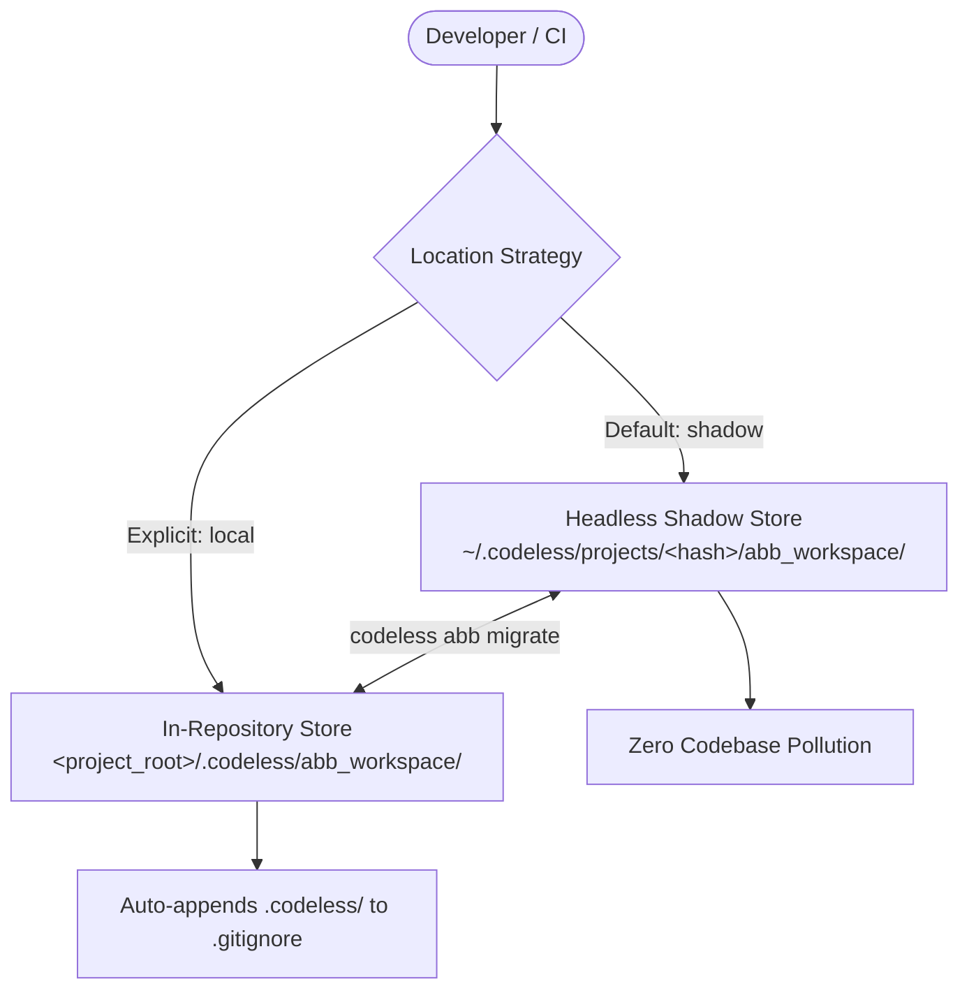

# Agent Buildable Base (ABB) Workspaces & Governance

The **Agent Buildable Base (ABB)** is the specification-first memory bank and task execution governance engine powering Codeless. ABB guarantees that autonomous agents adhere to explicit engineering contracts, maintain structured task graphs (DAGs), preserve architectural memory, and avoid destructive regressions.

---

## 1. Core Architecture

ABB structures an autonomous project into standard memory bank domains:

```text
abb_workspace/
├── agent.md                  # Core operational governance & verification policy
├── STACK.md                  # Technology stack, tools, & verification manifest
├── CONVENTIONS.md            # Coding conventions and style rules
├── tasks/                    # Task DAG
│   ├── goal/goal.md          # Primary project objective
│   ├── base/                 # Base Task milestones (Phase 0, 1, 2, ...)
│   └── sub/                  # Granular executable subtasks with YAML frontmatter
├── features/                 # Modular feature specifications
├── skills/                   # Execution skills with dual-format YAML indexing
├── references/               # 11-domain architectural memory bank (api, db, tests, etc.)
├── design/                   # High-level architecture and system design specs
└── workflows/                # Standard operating procedures & execution gates
```

---

## 2. Dual-Location Workspace Engine

Codeless supports two storage strategies for ABB workspaces:



### Mode Comparison

| Mode | Location | Best For | Codebase Cleanliness |
|---|---|---|---|
| **Shadow** *(Default)* | `~/.codeless/projects/<project_hash>/abb_workspace/` | Clean repo workflows, multi-repo work, CI pipelines | 100% clean — zero files added to project tree |
| **Local** | `<project_root>/.codeless/abb_workspace/` | Monorepos, in-repo shared task tracking | Isolated in `.codeless/`, auto-added to `.gitignore` |

---

## 3. Location Commands & Migration

### Selecting Location at Runtime
```bash
# Default shadow mode
codeless

# Force in-project local mode
codeless --abb-location local
```

### Checking Active Status
```bash
codeless abb status
```
*Sample Output:*
```text
ABB Workspace Status for 'my-project':
  Project Root: /home/user/my-project
  Configured Location: shadow (default)
  Resolved Workspace: /home/user/.codeless/projects/a1b2c3d4/abb_workspace
  Initialized: Yes
```

### Zero-Data-Loss Migration
You can transfer an existing workspace between `local` and `shadow` at any time:

```bash
# Migrate an existing local workspace to shadow storage
codeless abb migrate shadow

# Migrate from shadow to in-project local workspace
codeless abb migrate local
```

---

## 4. Virtualization & Transparent Access

The Codeless Virtualization Layer allows agents and slash commands to interact with standard relative paths (e.g. `tasks/sub/01_task.md`, `skills/qa/backend/SKILL.md`) regardless of whether the workspace is stored in-repo or in the shadow store.

### Resolution Precedence:
1. `CODELESS_ABB_ROOT` environment variable (if explicitly set).
2. Explicit CLI flag: `--abb-location local|shadow`.
3. Persistent project metadata (`~/.codeless/projects/<hash>/metadata.json`).
4. In-repo presence (`.codeless/abb_workspace/agent.md`).
5. Default fallback to global shadow storage (`~/.codeless/projects/<hash>/`).

---

## 5. Lifecycle Hooks & Frontmatter Guardrails

Every file operation on an ABB workspace is guarded by deterministic lifecycle hooks:

- **Frontmatter Schema Guard**: Rejects malformed YAML frontmatter in `tasks/` and `features/`.
- **DAG Dependency Guard**: Blocks transitioning a subtask to `status: done` or `in_progress` if any prerequisite `depends_on` tasks are not completed.
- **Auto Roll-Up**: Automatically rolls up subtask completions to parent Base Tasks and updates the system Goal.
- **Skill Staging Guard**: Blocks updates to `skills/skills.md` while unpurged artifacts remain in `skills/_staging/`.
- **Drift Detection Hook**: Heuristically alerts the agent if modifications cause architectural drift from `STACK.md`.
