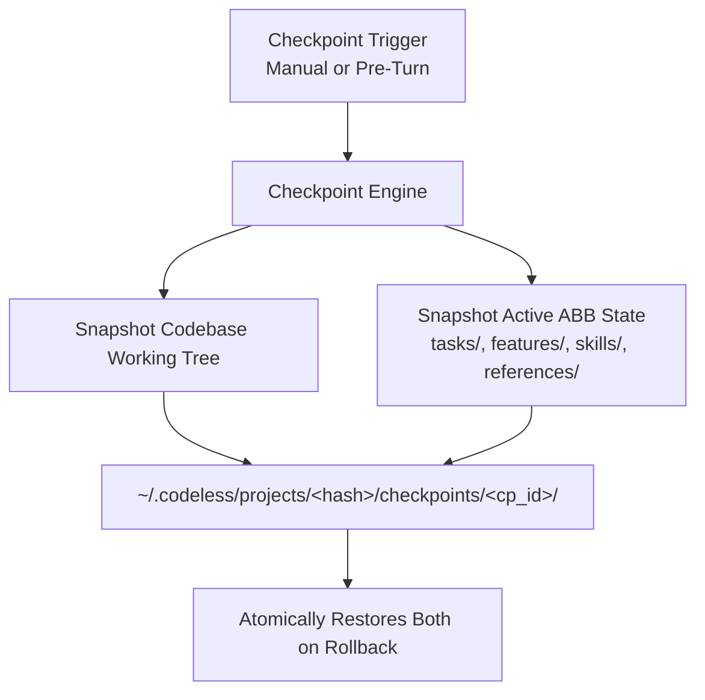

# Git Checkpoints & Rollback Engine

The **Git Checkpoint & Rollback Engine** provides an automated safety net for autonomous coding workflows. It creates atomic, synchronized rollback snapshots that capture both the **codebase working tree** and the **ABB task/spec state**, allowing complete recovery from regressions or failed refactorings.

---

## 1. Why Dual-State Checkpointing?

Traditional git branches only track source code. In autonomous agent environments, if an agent modifies 10 source files and marks 3 subtasks as `done`, reverting only the source code leaves the task tracker out of sync with reality (or vice versa).

**Codeless solves this by capturing both states synchronously:**



---

## 2. Interactive `/checkpoint` (`/cp`) Commands

The `/checkpoint` command is built into interactive sessions:

### Saving a Checkpoint
```text
/checkpoint save [name] [description]
```
*Example:*
```text
> /checkpoint save before_auth_refactor "Clean working state prior to OAuth integration"
🛡️ Checkpoint Saved:
  - ID: `cp_20260825_141500_3a8f1b`
  - Name: `before_auth_refactor`
  - Files: 42
  - Location: shadow
```

### Listing Saved Checkpoints
```text
/checkpoint list
```
*Sample Output:*
```text
🛡️ Saved Checkpoints:
  - `cp_20260825_141500_3a8f1b` [before_auth_refactor] - 2026-08-25T14:15:00Z (42 files)
  - `cp_20260825_130000_c9e2a1` [initial_seed] - 2026-08-25T13:00:00Z (38 files)

Commands: `/checkpoint save [name]`, `/checkpoint restore <id> [--force]`, `/checkpoint show <id>`
```

### Inspecting Checkpoint Details
```text
/checkpoint show before_auth_refactor
```
*Sample Output:*
```text
🛡️ Checkpoint Details:
  - ID: `cp_20260825_141500_3a8f1b`
  - Name: `before_auth_refactor`
  - Timestamp: 2026-08-25T14:15:00.123456+00:00
  - Description: Clean working state prior to OAuth integration
  - Git Commit: 7f8a9b1c2d3e4f5a6b7c8d9e0f1a2b3c4d5e6f7a
  - ABB Location: shadow
  - Files Tracked: 42
```

### Restoring / Reverting a Checkpoint
```text
/checkpoint restore <id_or_name> [--force]
```
*Example:*
```text
> /checkpoint restore before_auth_refactor --force
✅ Successfully restored checkpoint 'before_auth_refactor' (cp_20260825_141500_3a8f1b).
```

---

## 3. Working Tree Safety Guards

To prevent accidental data loss:
- If the project directory has **uncommitted modifications** that were not captured in the target checkpoint, `restore` will stop and warn you:

```text
⚠️ Working tree has uncommitted modifications. Restoring will overwrite these changes.
Use '--force' to proceed with restore.
```

---

## 4. Storage Isolation

All snapshot files and metadata are stored outside the repository in the user's global Codeless project directory:

```text
~/.codeless/projects/<project_hash>/checkpoints/
└── cp_20260825_141500_3a8f1b/
    ├── metadata.json
    ├── code/                 # Snapshot of tracked project files
    └── abb/                  # Snapshot of active ABB workspace
```

This guarantees that creating checkpoints never causes git pollution or git status noise in your repository.
