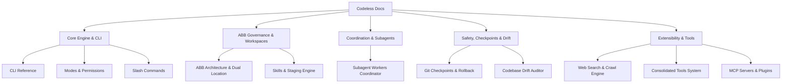

# Codeless Documentation Portal

Welcome to the comprehensive documentation suite for **Codeless** — the autonomous, specification-first coding agent and execution harness with built-in Agent Buildable Base (ABB) governance, subagent worker coordinator, dual-location shadow workspaces, and safety checkpoints.

---

## Documentation Map

---

## Topic Guides

### 1. Core Engine & CLI
- [**CLI Reference**](cli_reference.md): Complete guide to all `codeless` command-line commands, flags, effort options, and headless automation parameters.
- [**Operational Modes & Permissions**](modes_and_permissions.md): Deep dive into the 4 operational modes (`PLAN`, `AGENT`, `ASK`, `CODEBASE`), write boundaries, and execution gates.
- [**Interactive Slash Commands**](slash_commands.md): Quick reference for in-session slash commands (`/mode`, `/drift`, `/checkpoint`, `/tasks`, `/plan`, etc.).

### 2. Agent Buildable Base (ABB) Governance
- [**ABB Workspaces & Dual-Location Engine**](abb_agent_buildable_base.md): Architecture of shadow workspaces (`~/.codeless/projects/<hash>/`) vs in-project local workspaces (`.codeless/`), migration commands, and automatic `.gitignore` protection.
- [**Skills System & Pull-Adapt-Delete**](skills_and_staging.md): Dual-format YAML skill indexing (A4), multi-domain directory hierarchies, and hook-enforced staging validation.

### 3. Multi-Agent Coordination & Concurrency
- [**Subagent Workers & Concurrency Coordinator**](subagent_workers.md): Headless worker dispatch, hermetic context sandboxing (`WorkerContextPackage`), and strict $\le 3$ concurrent worker bounds.

### 4. Safety, Drift & Rollback
- [**Git Checkpoints & Rollback Engine**](checkpoints_and_rollback.md): Synchronized dual-state snapshots (codebase working tree + active ABB state) and interactive `/checkpoint` save/restore.
- [**Codebase Drift Auditor**](drift_auditor.md): Multi-dimensional drift detection comparing code and specs against `STACK.md`, and automated technical debt logging via `/drift --feed-issues`.

### 5. Extensibility & Web Engine
- [**Unified Web & Crawl Engine**](web_crawl_and_research.md): Integrated Crawl4AI web extraction, search, and structured markdown synthesis.
- [**Consolidated Tool System**](tool_system_and_consolidation.md): Unified CRUD tools (`cron`, `task`, `worktree`, `mcp_resource`) and action-level permission controls.
- [**MCP Servers & Plugins**](mcp_and_plugins.md): Integrating external Model Context Protocol servers (stdio and HTTP) and custom workflow plugins.
- [**Showcase & Workflows**](SHOWCASE.md): Real-world workflows, prompt recipes, and headless CI automation snippets.
