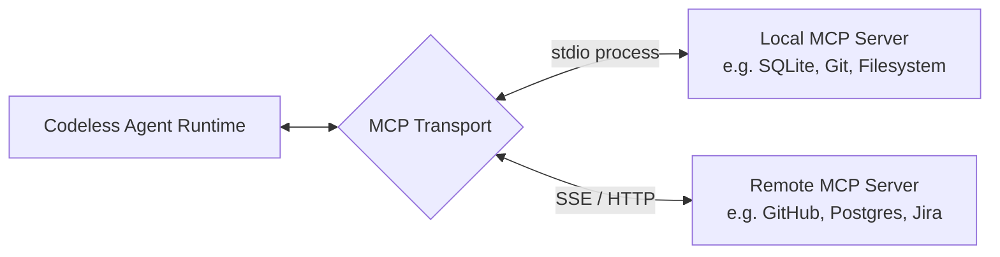

# MCP Servers & Plugin Extensibility

Codeless supports deep extensibility via the open **Model Context Protocol (MCP)** and modular **Workflow Plugins**, enabling seamless connection to databases, third-party dev tools, internal corporate APIs, and customized agent skill bundles.

---

## 1. Model Context Protocol (MCP) Integration

MCP standardizes how AI agents discover tools, prompt templates, and structured resources from external server processes.



### Transport Types Supported
- **`stdio`**: Local subprocess standard input/output (fast, isolated, zero network overhead).
- **`sse` / HTTP**: Remote server-sent events for cloud services or hosted microservices.

---

## 2. Managing MCP Servers

You can manage MCP integrations using the `codeless mcp` CLI:

### Listing Configured Servers
```bash
codeless mcp list
```

### Adding a Local Stdio MCP Server
```bash
# Add SQLite MCP server
codeless mcp add sqlite "npx -y @modelcontextprotocol/server-sqlite --db-path ./app.db"

# Add GitHub MCP server with environment variables
codeless mcp add github "npx -y @modelcontextprotocol/server-github" -e GITHUB_TOKEN=ghp_xxx
```

### Adding a Remote HTTP / SSE MCP Server
```bash
codeless mcp add internal_docs --url "https://mcp.internal.company.com/sse"
```

### Testing Server Connectivity
```bash
codeless mcp test sqlite
```

### Removing a Server
```bash
codeless mcp remove sqlite
```

---

## 3. Workflow Plugins

Plugins allow bundling custom skills, agent prompt profiles, and domain rules into reusable packages that can be shared across multiple repositories.

```text
~/.codeless/plugins/<plugin_name>/
├── plugin.json               # Manifest (name, version, entrypoints)
├── skills/                   # Custom skills provided by plugin
├── rules/                    # Project-specific rules and prompt injections
└── hooks/                    # Custom lifecycle hook handlers
```

### Installing a Plugin
```bash
# Install from local directory
codeless plugin install ./my-custom-plugin

# List active plugins
codeless plugin list
```

---

## 4. MCP Dynamic Resource Reading (`mcp_resource`)

When an agent needs to inspect live data from an MCP server, it uses the consolidated `mcp_resource` tool:

```json
{
  "action": "read",
  "uri": "sqlite://schema/users"
}
```

The agent can query schemas, inspect database rows, read remote issue logs, or stream real-time telemetry directly into the context window.
