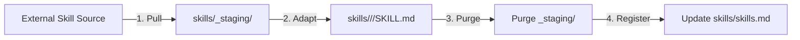

# Skills System & Pull-Adapt-Delete Lifecycle

Codeless features an extensible, domain-structured **Skills Library** governed by the **Skill Bridge** and the **Pull-Adapt-Delete** workflow. Skills provide repeatable, context-aware operational instructions that agents automatically load when executing specialized engineering tasks.

---

## 1. Skill Bridge & Dual-Format Indexing (A4)

Skills are organized into domain categories (`backend`, `qa`, `debug`, `ui`, `practice`, `research`).

The primary index in `skills/skills.md` uses a dual-format structure:
1. **Human Summary Table**: For rapid manual inspection and documentation.
2. **Machine-Readable YAML Index**: For deterministic agent parsing and dynamic loader registration.

```markdown
# Skills Registry

## Index
| Skill | Domain | Path | Purpose |
|---|---|---|---|
| Backend QA | QA | qa/backend/SKILL.md | API & backend unit testing guidelines |
| Systematic Debugging | Practice | practice/systematic_debugging/SKILL.md | Root-cause isolation workflow |

```yaml
skills:
  - name: qa_backend
    path: qa/backend/SKILL.md
    description: API & backend unit testing guidelines
    version: 1.0.0
    aliases: ["qa/backend", "backend_test"]
  - name: practice_systematic_debugging
    path: practice/systematic_debugging/SKILL.md
    description: Root-cause isolation workflow
    version: 1.0.0
    aliases: ["debug/systematic"]
```
```

---

## 2. Directory Hierarchy

```text
skills/
├── skills.md                   # Primary Dual-Format Index
├── manage_skills.md            # Skill creation & management protocol
├── _staging/                   # Temporary holding area for external imports (PULL)
├── backend/
│   ├── api_design/SKILL.md
│   └── domain_modeling/SKILL.md
├── qa/
│   ├── backend/SKILL.md
│   ├── frontend/SKILL.md
│   ├── docker/SKILL.md
│   └── e2e/SKILL.md
├── debug/
│   └── traceback/SKILL.md
└── practice/
    ├── systematic_debugging/SKILL.md
    ├── tdd/SKILL.md
    └── code_review/SKILL.md
```

---

## 3. The Pull-Adapt-Delete Workflow

When importing external skills or adapting knowledge from third-party repositories, Codeless strictly enforces the 3-stage lifecycle:



### Stage 1: PULL (Temporary Staging)
Download or pull external skill markdown into `skills/_staging/<skill_name>/`.
> **Rule**: External skills in `_staging/` are temporary and must not be directly registered in the index.

### Stage 2: ADAPT (Local Standardization)
Refactor the skill into a native domain directory (`skills/<domain>/<name>/SKILL.md`):
- Add standard YAML frontmatter (`id`, `version`, `links`).
- Align instructions with project conventions and `agent.md`.

### Stage 3: DELETE (Purge Staging)
Delete all temporary files from `skills/_staging/`.

---

## 4. `SkillStagingHook` Guardrail

To prevent repository clutter and incomplete adaptations, the **`SkillStagingHook`** runs before any file write tool:

- If an agent or user attempts to modify `skills/skills.md` while `skills/_staging/` contains any files, the operation is **immediately blocked**:

```text
🛑 Tool Execution Blocked by ABB Skill Staging Guard:
Cannot update 'skills/skills.md' while unpurged artifacts remain in 'skills/_staging/'.
Follow the Pull-Adapt-Delete protocol:
  1. Adapt staged skills into their proper domain folder (e.g. skills/qa/<name>/SKILL.md).
  2. Purge/delete the staged files in skills/_staging/.
  3. Register the adapted skill in skills/skills.md.
```

---

## 5. Using Skills in Tasks & Sessions

### Explicit Subtask Binding
In any subtask frontmatter (`tasks/sub/*.md`), declare the skills required for the task:

```yaml
---
id: sub_012
version: 1.0.0
status: pending
skills:
  - qa_backend
  - practice_tdd
---
```

When a worker agent executes the subtask, the coordinator automatically extracts the full text of `qa_backend` and `practice_tdd` and packages them into the worker's prompt context.

### Discovering Skills Interactively
In the terminal session, use the `/skills` slash command to inspect loaded skills:

```text
/skills
```
