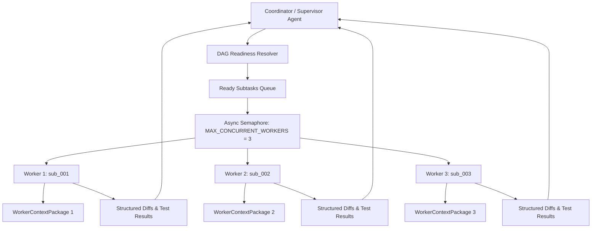

# Subagent Workers & Concurrency Coordinator

Codeless incorporates a multi-agent execution coordinator designed to dispatch **headless worker agents** to execute independent tasks in parallel while preventing context pollution, race conditions, or unbounded resource consumption.

---

## 1. Coordinator Architecture



---

## 2. Strict Concurrency Bound ($\le 3$ Workers)

To protect local system resources, avoid API rate limits, and eliminate file-write race conditions, the coordinator enforces a strict hard-coded ceiling:

```python
MAX_CONCURRENT_WORKERS = 3
```

- When multiple subtasks become unblocked simultaneously in the task DAG, the coordinator queues them through an `asyncio.Semaphore(3)`.
- As each worker completes its edits, tests, and verification, the next queued worker is immediately scheduled.

---

## 3. Hermetic Context Sandboxing

A common pitfall in multi-agent swarms is context pollution — where workers ingest irrelevant prompt history or sibling subtask details. Codeless eliminates this with **`WorkerContextPackage`**.

Each worker receives an isolated payload containing only:
1. **Target Subtask**: File path, ID, and raw Markdown content.
2. **Explicit Linked Documents**: Only the files declared in the subtask's YAML frontmatter `links:` field.
3. **Referenced Memory Snippets**: Relevant architectural guidance from `references/`.
4. **Assigned Skill Bodies**: The explicit skill instructions declared in the subtask `skills:` field.
5. **Active Workspace Environment**: The supervisor's resolved ABB location (`local` vs. `shadow`), ensuring the worker interacts with the exact same virtualization layer.

```python
@dataclass
class WorkerContextPackage:
    subtask_id: str
    subtask_file: Path
    subtask_content: str
    linked_files: dict[str, str]       # relative_path -> content
    reference_snippets: dict[str, str]
    assigned_skills: dict[str, str]
    abb_location: str                  # 'local' | 'shadow'
```

---

## 4. Automatic DAG Readiness Detection

The coordinator automatically evaluates the task dependency graph in `tasks/sub/`:

```python
ready_tasks = find_ready_subtasks(abb_workspace / "tasks")
```

A subtask is classified as **Ready** if:
- Its `status` is currently `pending`.
- Every subtask listed in its frontmatter `depends_on:` list has `status: done`.

---

## 5. Usage in Prompts & Workflows

### Interactive Prompt Example
You can instruct Codeless to coordinate subtasks directly from the chat:

```text
Inspect tasks/sub/ and dispatch ready subtasks to worker agents in parallel.
```

### Worker Execution Lifecycle
1. **Supervisor** scans the DAG and identifies unblocked subtasks.
2. **Coordinator** builds isolated `WorkerContextPackage` instances.
3. **Headless Workers** run in parallel (up to 3 concurrent).
4. Each worker performs its edits and executes **Two-Track verification** (`pytest`, linters).
5. Workers return structured execution summaries and diffs.
6. **Supervisor** reviews the results and marks the subtasks `done`.
